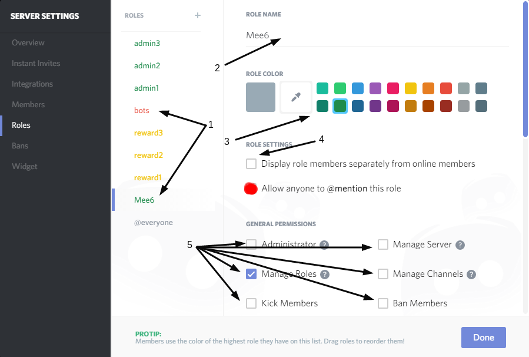

##Levels
###Let your members gain **xp** and **levels** by participating in the chat !


1) This text will be writed by bot when someone will get level up.
You can change it if you want to but remember you need to use `level {level}` to make bot write level in msg

2) If you will enable `Send in whisper` then bot will send level up msg to pm (private message)

3) Type how much seconds need person to wait before using `!rank` command again

4) Here you can type roles that will not get xp.
Example i will create role `no xp` then give it to someone like spammers. At  dashboard i will add `no xp` role to banned roles list and they will not get xp.

5) To save changes press `Update` button at bottom of page.

###Role reward
####First how to setup mee6 role for levels



1) Find role `Mee6` or create one like `bots` and open it.

2) If you want you can change role name.

3) If you want you can change role color. This will affect people name color who has this role. `This role is for bot only give to mee6 bot or other bots`

4) If you will enable `Display role members separately from online members` you will see bot in special list for him:


5) You need to allow bot manage Roles but give bot all permissions because he needs them.

####To setup role reward


1) Create role for role reward or if you have open it.

2) Now you can name role. Example i will make name GREEN.

3) you can give color for role, if person hits needed level to get role he will get color role. Example i will set color GREEN because its green color role.

4) If you will enable `Display role members separately from online members` you will see people in special list for them:


5) If you want you can setup role lets say kick people and get it by hitting lets say level 30 (setup high level reward to get role like this) then you need to give permission `Kick Members` .

6) You are done here now press `Done` button and go to this link [Mee6 servers](https://mee6.xyz/servers)

####How to setup role reward at dashboard


1) Find your roles you want to make level rewards.

2) Choose from which level roles will be given to people.

3) Press button `Update` to update changes.

```Disclaimer When a role is given as a reward, it could only be removed manually!```
