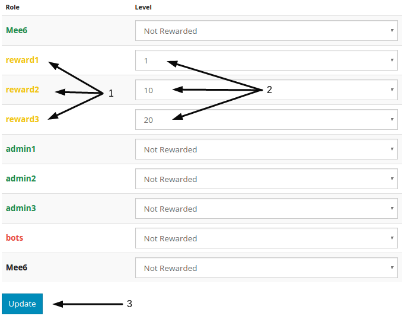

#Levels
##Let your members gain **xp** and **levels** by participating in the chat !
###Setup:
Go to [Mee6 dashboard](https://mee6.xyz/servers) and select your server.
Now select `levels`-plugin.
You will see this: 


1) This text will be writed by bot when someone will get level up.
you can set your own message here and use {player} and {level} as variablen.

2) If you enable `Send in whisper` then mee6 will send the level up msg to the player in a DM(Direct message or whisper).

3) Some spam the `!rank` command, you can set here how long they need to wait between 2 `!rank` commands.

4) Here you can set the roles that will not get xp.
Let's say that you got a couple of bots in your server. You don't want them do gain xp, right? So add the roles of your bots here.
Or to let spammers stop: create a role `no xp` and set that in here, when someome start spamming chat give them this role.

5) To save changes press the `Update` button at the bottom of the page.

##Role reward
###setup
####mee6 role and needed permissions


(for role setting in discord: menu symbol next to server name=>server settings=>roles)
to let this work you need to make sure that Mee6 has `manage roles` in one of his ranks and that Mee6 has a rank higher then de ranks he needs to give.
In the example has Mee6 the Mee6 ranks wich has `manage roles`-premission, but he also has the bot rank which is higher then the ranks he need to give.
We could give the bot rank here the manage roles and remove the Mee6 rank, it would still work the same.

###setup role reward


first you will have to create a role to give, what you add to your role is completly your choise(color, more permissions, ....).
Again, make sure that Mee6 has at least 1 role that is higher in the list then the role that you want to give as reward.

####How to setup role reward at dashboard
Now go back to your dashboard=>level-plugin and scroll down.


> (the order of the roles shown here is the order that these roles where made)

1) Find the roles that you want to give as rewards.

2) Choose the level that people need to earn this role.

3) When your done press the `Update` button.

!!! if you have already a lot of users that will earn reward directly then wait after pressing the done button, Mee6 can only give 10 roles a minute in each server because of discord limitations for bots! He will als not be able to respond to normal commands while aplying big groups of roles.

```
Disclaimer: When a role is given as a reward, it can only be removed manually!
```
