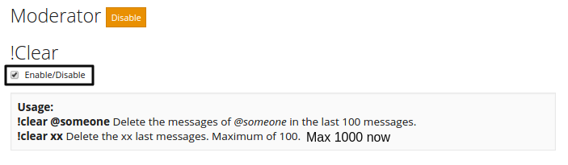

!!! warning
    this page needs grammar correction and functionality check,
    not everything on here is right

#Moderator plugin
> Cool moderator commands !slowmode/clear/mute
##mee6 role and needed permissions

(for role setting in discord: menu symbol next to server name=>server settings=>roles)

to let this work you need to make sure that Mee6 has `all permissions` in one of his ranks.
We could give the bot rank here all permissions and remove the Mee6 rank, it would still work the same.

##Clear command

To use clear command enable it by clicking on a check box and then pressing `Update` button at the bottom of a page.

This command will clear chat messages.
 
 To use it type in chat `!clear 1-1000` or to clear person messages not all use `!clear @nameofperson`

##Slowmode command

To use Slowmode command enable it by clicking on a check box and then pressing `Update` button at the bottom of a page.

This command will slow chat.
Example I will turn on slowmode for 10 seconds and all people can only type 1 message in 10 seconds. (Admins can spam)(Admins are who can access dashboard)
 
 To use it type in chat `!slowmode (seconds)` or to turn off Slowmode use `!slowoff`

##Mute command

To use Mute command enable it by clicking on a check box and then pressing `Update` button at the bottom of a page.

This command will mute person.
Example I will turn on mute on @testaccount and now test account can't type in channel. I activated command, now I will unmute @testaccount and he can type again.
 
 To use it type in chat `!mute @username` or to turn off Mute use `!unmute @username`

##Banned words

To use banned words system enable it by typing words to be banned and then pressing `Update` button at the bottom of a page.

This system will delete banned words from chat.
Example I will add ass word to banned words list then try typing that word with test account, bot deletes bad word message and in chat types, message `your name, LANGUAGE!!! 😡`

##Moderator roles

To use Moderator roles enable it by typing roles names and then pressing `Update` button at the bottom of a page.

This will allow use Moderator commands for other people.
Example I will add role `Admin` and `Mod` then people who have role `Admin` or `Mod` can use Moderators commands
