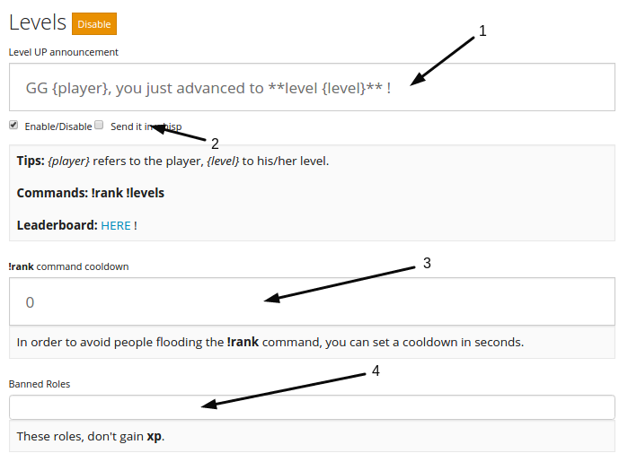
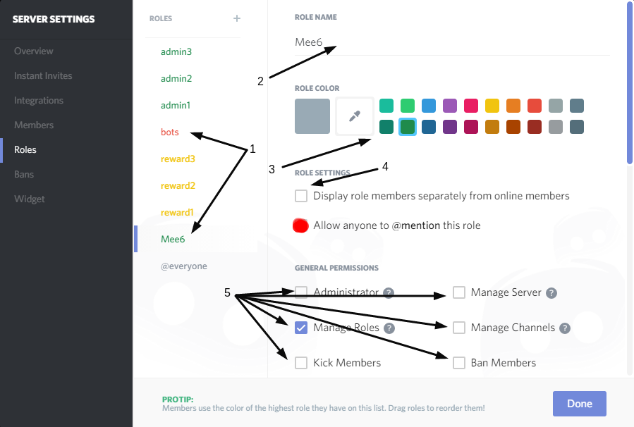
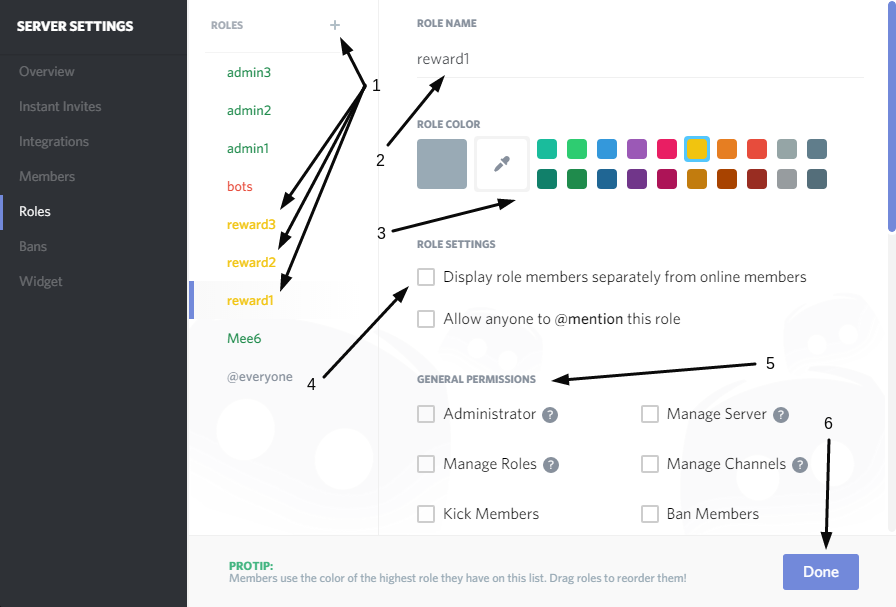
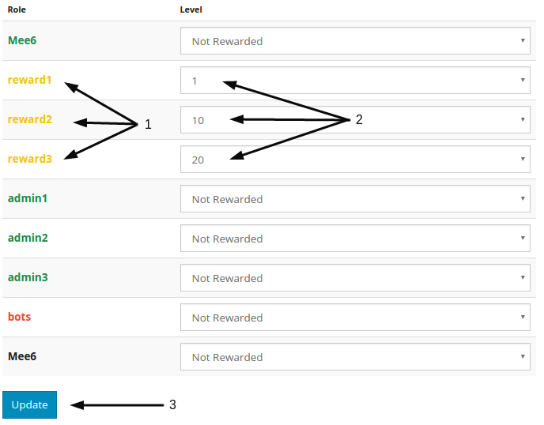

# Levels plugin

## Let Your Members Gain **Experience** and **Levels** by Participating in The Chat !

### Setup:

Go to [Mee6 Dashboard](https://mee6.xyz/servers) and select your server.  
Select the `Levels` Plugin.  
You should now see:

  
1) This message is shown upon Leveling Up, Modify this to how you desire.  
> {player} Will display the Discord User in a Mention; {level} Will display the New Level in Numeric Form (1,2,3)  

2) Enabling `Send in whisper`, will cause Mee6 to DirectMessage the player directly instead of a public chat.  

3) If `!rank` or `!rank @some_user` is used too often, you can enable this for time (in seconds) you wish for them to have to wait.  

4) Here you can set `Black Listed` roles to not gain Experience.  
> Let's say that you got a couple of bots or people who spam for levels in your server and you do not want them to gain Experience; Try giving them "Bots" or "Spammer" role and blacklist that role after.  

5) To save any changes, press `Update` near the end of the page.  
  
## Role Rewards

### Setup
  
#### Mee6 Role and Required Permissions

1) Locate your Roles and give Mee6 or your variant of "Bots" Role the permission `Manage Roles`  
> Manage Roles is Required to allow Mee6 to apply the roles from rewards to the user.
Mee6's Bot Role is Required to be higher than the roles it is applying to users. (Per Discord's newer "Role Hierarchy" System)

### Setup Role Reward

  
> Create the `Role` how you wish and Modify/Customize it's Names, Colors, Permissions, and Everything Else.
  
#### Applying Role Rewards in the Dashboard

Now, Open your Dashboard and Navigate to the `Levels` Plugin Page.

> The Order here is Dependant on the order the Roles are Created!
  
1) Find the roles that you want to give as rewards.
2) Choose the level that people need to earn this role.
3) When your done press the `Update` button.
  
!!! If you apply a Role with a `Large Number of Discord Users`, it may take quite a while (Due to Discord Limitations of `10 Roles/60 Seconds`) to Update every user with the New Role. (Please Contact Support if all your users do not have the Roles they should after a 24 Hours at most.)
  
!!!Disclaimer: When a role is given as a reward, it can only be removed manually!
